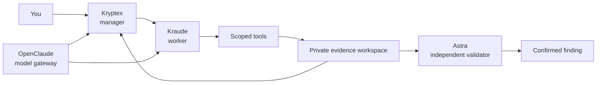
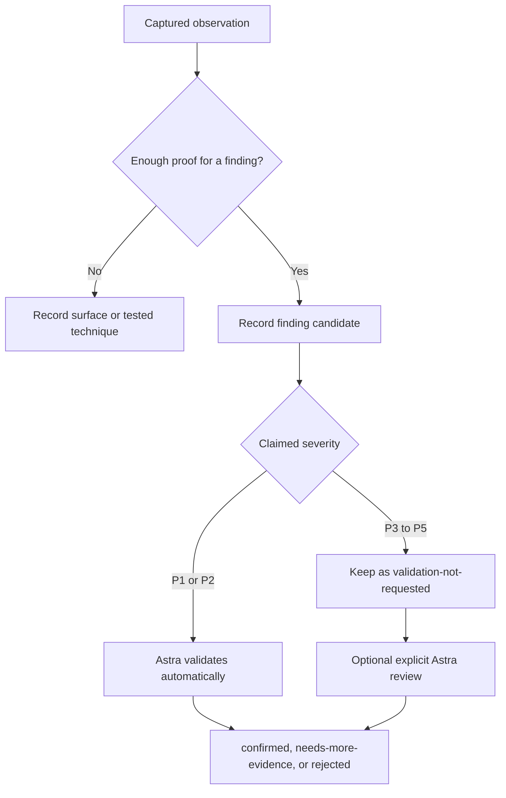

# Grypton Code

Grypton Code is a persistent, tool-using security-testing workspace. You give it a target and a clear scope. It keeps the work, captures, decisions, findings, and validation results in one engagement directory.

Use Grypton only for systems you are allowed to assess.

Grypton uses the local OpenClaude installation at `/root/openclaude` as the
model gateway for Kraude and Kryptex. OpenCode still hosts their sessions and
tools. Astra validation remains a separate, direct Codex process.

```bash
cd /root/grypton
./bin/grypton doctor
```

If `doctor` shows `OK`, the local binaries, route metadata, key-pool shape, and
MCP wiring are ready. `doctor` does not make a paid inference or prove that a
provider account is currently authenticated; use the local smoke test described
below before a long run.



## What each role does

| Role | What it does | Model route |
| --- | --- | --- |
| **Kraude** | Maps the target, uses the scoped tools, records evidence, and writes finding candidates. | `zai-coding-plan/glm-5.3` at `max` |
| **Kryptex** | Manages Kraude, chooses the next useful step, corrects weak work, and handles ordinary blockers. | `go/muse-spark-1.3-contributor` at `xhigh` |
| **Astra** | Independently reviews serious finding evidence. | `gpt-6-astra` at `max` |

Kryptex does not validate its own worker. New P1 and P2 findings go to Astra automatically. P3, P4, and P5 findings stay recorded until you explicitly request validation.

Kraude receives a deliberately small role prompt: the target, the recorded
scope URLs, severity acceptance data, out-of-scope finding categories, and the
operator or Kryptex instruction for that turn. Grypton passes an explicit
operator mission verbatim and does not prepend generated conduct rules. The
OpenCode session supplies the available tool schemas automatically, while the
tools enforce and capture the recorded scope in code.

## Set up OpenClaude and the key pool

Before a real run, Grypton expects:

- Node.js and OpenCode on `PATH`;
- a complete OpenClaude checkout at `/root/openclaude` with
  `openclaude.config.json`;
- the OpenClaude `go` provider configured to use the OpenCode Go credential
  and `/root/open` as its `keyFile`;
- at least two unique API keys in `/root/open`, one per non-empty line, with
  private file permissions;
- Codex configured for the independent Astra validator.

Never put a literal API key in Grypton configuration, a command, a report, or
an engagement file. OpenClaude reads the primary OpenCode credential and the
key file inside its sidecar. Grypton receives only an authenticated loopback
gateway address and sanitized status events.

The default role selections are:

```text
Kraude   zai-coding-plan/glm-5.3         max
Kryptex  go/muse-spark-1.3-contributor   xhigh
Astra    gpt-6-astra                      max
```

`opencode-go/...` is accepted as a legacy input and normalized to the public
OpenClaude route `go/...`. Set `GRYPTON_OPENCLAUDE_HOME` if OpenClaude is
installed somewhere else, or `GRYPTON_OPENCLAUDE_CONFIG` to select another
OpenClaude configuration file.

## Five ideas to know first

| Word | Meaning |
| --- | --- |
| **Target** | The host, URL, network, artifact, or other thing being assessed. |
| **Engagement** | One saved assessment. Its name is made from the target. |
| **Scope** | What Grypton may touch and what it must avoid. |
| **Flow** | A saved request and response capture. |
| **Finding** | A candidate issue with a saved proof. It is only confirmed after the required Astra review. |

All engagement data lives under `.state/engagements/`. The top-level `target/` directory stays empty.

---

# Quick start

## Start with the local lab

The local lab is the easiest way to learn the interface. It runs only on your own machine.

In the first terminal:

```bash
cd /root/grypton
./bin/grypton lab --port 18767
```

In the second terminal:

```bash
cd /root/grypton
./bin/grypton --target "http://127.0.0.1:18767" \
  "Map the local web application and verify the profile API"
```

Grypton opens the interactive console, starts Kraude, and shows each turn as it happens.

## Start an authorized engagement

Start with `plan`. It checks the target, scope, models, and matching playbooks. It does not create an engagement or call a model.

```bash
./bin/grypton plan \
  --target "https://app.example.test" \
  --type web \
  --in-scope "app.example.test,api.example.test" \
  --out-scope "admin.example.test" \
  -m "Map the public web and API surface"
```

Start the engagement when the plan looks right:

```bash
./bin/grypton --target "https://app.example.test" \
  --type web \
  --in-scope "app.example.test,api.example.test" \
  --out-scope "admin.example.test" \
  "Map the public web and API surface"
```

You can also use the explicit form:

```bash
./bin/grypton init \
  --target "https://app.example.test" \
  --type web \
  -m "Map the public web and API surface"
```

Both forms do the same thing.

---

# Starting, continuing, and stopping

Grypton supports the familiar Code-style shortcuts and the explicit command form.

| Task | Command |
| --- | --- |
| Start an interactive engagement | `./bin/grypton --target HOST "mission"` |
| Start without terminal input | `./bin/grypton -p --target HOST "mission"` |
| Start with the explicit command | `./bin/grypton init --target HOST -m "mission"` |
| Start a finite background run | `./bin/grypton init --target HOST --background --duration 12h -m "mission"` |
| Continue the newest engagement | `./bin/grypton -c` |
| Resume one engagement | `./bin/grypton -r ENGAGEMENT` or `./bin/grypton resume ENGAGEMENT` |
| Supervise an existing engagement that is not running | `./bin/grypton run start ENGAGEMENT` |
| Check a background run | `./bin/grypton run status ENGAGEMENT` |
| Read supervisor events | `./bin/grypton run logs ENGAGEMENT` |
| List engagements | `./bin/grypton status` or `./bin/grypton ls` |
| Stop a background run | `./bin/grypton run stop ENGAGEMENT` |
| Request a normal engagement stop | `./bin/grypton stop ENGAGEMENT` |

`HOST` can be a hostname or a URL. `ENGAGEMENT` is the saved engagement name shown by `status`. For example, `https://app.example.test` becomes `https-app-example-test`.

## Run options

Creation and execution options are listed together below. `--target`, `--type`,
the scope and program options, and `--force` apply only when creating an
engagement with `init` or the direct start form. A resume uses the scope already
saved in that engagement. `run start --help` shows its smaller supervisor-safe
subset; it always runs detached with quiet, non-interactive output.

| Option | What it means |
| --- | --- |
| `--target HOST` | Required target for a direct start. |
| `--type TYPE` | Target type: `auto`, `web`, `api`, `network`, `cidr`, `binary`, or `contract`. |
| `-m "mission"` | Short description of the work you want done. |
| `--in-scope A,B` | Comma-separated targets Grypton may use. |
| `--out-scope A,B` | Comma-separated targets Grypton must avoid. |
| `--only P1,P2` | Suppress other severities from confirmed and headline results while retaining their audit records. |
| `--include CLASS` | Focus on these vulnerability classes. |
| `--exclude CLASS` | Avoid these vulnerability classes. |
| `--rule "text"` | Add a permanent engagement rule. Repeat this option when needed. |
| `--authorization-file FILE` | Save a hash of an authorization record with the engagement. |
| `--bugcrowd-brief FILE` | Import scope and automation rules from a saved Bugcrowd brief. |
| `--kraude-model ROUTE` or `--model ROUTE` | Use this OpenClaude route for Kraude. |
| `--kraude-effort LEVEL` | Set Kraude's supported reasoning effort. |
| `--kryptex-model ROUTE` | Use this OpenClaude route for Kryptex. |
| `--kryptex-effort LEVEL` | Set Kryptex's supported reasoning effort. |
| `--permission-mode scoped` | Use Grypton's scope-checked, captured-tool mode. |
| `-p` or `--print` | Do not wait for console input. Keep the event stream in stdout. |
| `--console quiet` | Start with compact terminal output. Also accepts `normal` and `full`. |
| `--max-turns N` | Stop after at most `N` worker turns. |
| `--max-seconds N` | Stop after at most `N` seconds. |
| `--auto-stop-time N` | Stop after at most `N` minutes. |
| `--duration DURATION` | Set a finite duration such as `90m` or `12h`. |
| `--background` | Run under the detached private supervisor. A finite time limit is required. |
| `--health-interval DURATION` | Record background health counters at this interval. Default: `10m`. |
| `--restart-limit N` | Allow at most `N` safe supervisor restarts after an abnormal exit. Default: `3`. |
| `--stop-on-p1` | Stop after a confirmed P1. |
| `--force` | Reuse the existing engagement name and reset its run state. |

## Useful examples

Start a web assessment with a clear boundary:

```bash
./bin/grypton --target "https://app.example.test" \
  --type web \
  --in-scope "app.example.test,api.example.test" \
  --out-scope "status.example.test,admin.example.test" \
  --rule "Do not test account recovery" \
  "Map the public attack surface, then test the highest-value in-scope paths"
```

Start an API assessment with a time limit:

```bash
./bin/grypton --target "https://api.example.test" \
  --type api \
  --max-turns 12 \
  --auto-stop-time 45 \
  "Map documented and observed API routes, then verify access boundaries"
```

Resume quietly and write the stream to a log:

```bash
./bin/grypton resume https-api-example-test --console quiet -p | tee grypton-run.log
```

## Run for hours without keeping a terminal open

Start a new engagement directly under Grypton's private supervisor:

```bash
./bin/grypton init \
  --target "https://app.example.test" \
  --type web \
  --background \
  --duration 12h \
  --health-interval 10m \
  --restart-limit 3 \
  -m "Map the authorized surface and verify the strongest evidence"
```

Use these commands from another terminal:

```bash
./bin/grypton run status https-app-example-test
./bin/grypton run logs https-app-example-test --limit 30
./bin/grypton run stop https-app-example-test
```

To supervise an existing engagement that is not currently running, run:

```bash
./bin/grypton run start https-app-example-test \
  --duration 12h --health-interval 10m --restart-limit 3
```

`run start` uses a 12-hour limit when you omit every time-limit option. A
background `init` or `resume` must include `--duration`, `--max-seconds`, or
`--auto-stop-time`.

A detached finite run keeps requesting new Kryptex-directed pivots when its
current leads converge, using the deadline as its normal completion boundary.
An operator stop or a binding scope/program stop can still end it sooner.

The lifecycle log contains timestamps, process state, exit codes, and workspace
counters. It does not contain the mission, prompts, tool arguments, evidence,
or credentials. Before a network, process, installer, or workspace-mutating MCP
handler begins, Grypton durably records an argument-free restart-safety marker.
A supervisor restarts the engine only after an abnormal exit that happened
before any such handler began. Completed private read-only calls do not disable
a safe restart. It does not restart a clean exit, a policy or scope stop, an
operator stop, or a run that has started an effectful tool. Background startup
also rejects an engagement whose shared engine lock is held by a foreground
run.

---

# Choose Kraude and Kryptex models

OpenClaude supplies the model catalog for both roles. Astra is deliberately not
part of this selection: it stays on direct Codex with `gpt-6-astra` at `max`.

## Browse available routes

```bash
# Show available OpenClaude routes
./bin/grypton models

# Search route IDs, providers, labels, and models
./bin/grypton models glm
./bin/grypton models muse

# Include disconnected or unsupported catalog entries when diagnosing
./bin/grypton models --all

# Machine-readable available routes and current defaults
./bin/grypton models --json
```

Grypton refuses a route that OpenClaude marks unavailable. Kraude's route must
support tool calls. Grypton also refuses an effort level that the selected
route does not support.

## Change global defaults

These commands save private global defaults in `/root/grypton/grypton.json`:

```bash
./bin/grypton models \
  --set-kraude zai-coding-plan/glm-5.3 \
  --kraude-effort max

./bin/grypton models \
  --set-kryptex go/muse-spark-1.3-contributor \
  --kryptex-effort xhigh
```

Global defaults apply when a new engagement does not supply role flags. They do
not silently replace the model already saved for an existing engagement.

## Select models for one engagement

Use role flags with `plan`, `init`, a direct start, or `resume`:

```bash
./bin/grypton init \
  --target "https://app.example.test" \
  --kraude-model zai-coding-plan/glm-5.3 \
  --kraude-effort max \
  --kryptex-model go/muse-spark-1.3-contributor \
  --kryptex-effort xhigh \
  -m "Map the authorized web surface"
```

The route and effort are saved in the engagement. A later `resume` uses those
saved values unless you pass new role flags.

## Change a role during a run

In the interactive console:

```text
❯ /model
❯ /models glm
❯ /model kraude zai-coding-plan/glm-5.3 max
❯ /model kryptex go/muse-spark-1.3-contributor xhigh
```

The change is queued and applied at the next safe role boundary. Grypton opens
a fresh provider session for that role so a transcript from one vendor or model
is not replayed to another. Findings, flows, progress, scope, and other durable
engagement records remain available. The new selection is saved for resume.

## Automatic API-key failover

OpenClaude builds each provider's key pool from the configured primary
credential followed by the lines in its `keyFile`. For the Go plan, that key
file is `/root/open`. Duplicate keys are removed without printing their values.

OpenClaude automatically moves to the next usable key when the provider answer
shows a key-specific condition:

- HTTP 401 or 402;
- a 403 identified as data-policy, blocked-account, credit, quota, or billing;
- a 429 identified as a spent usage plan, account limit, credits, or balance.

The failed key enters a cooldown, so later requests do not immediately reuse
it. Temporary connection failures and HTTP 408, 425, or 5xx responses are
retried with bounded delay when the configured retry window permits it.

Grypton does not rotate keys for a malformed request, an unknown model, an
unsupported effort, a tool error, or a scope denial because a different key
cannot fix those conditions. OpenClaude never replays a request after a
response has begun. This avoids duplicate tool activity and duplicate probes.
Sanitized gateway, request, effort, and rotation notices are written under the
engagement's `transcripts/` directory; API keys are never written there.

---

# The interactive console

The terminal is designed like a Code-style session. It has a compact startup card, a `❯` prompt, streamed work, and slash commands.

- Type ordinary text to talk to **Kryptex**.
- Type `/worker ...` to give **Kraude** a direct instruction for its next work burst.
- Type `/stop` when you want the engagement to end cleanly.
- Press `Ctrl-C` when you need to interrupt the terminal immediately.

Your messages are saved as standing instructions for the engagement. Kryptex receives them and turns useful instructions into concrete work for Kraude.

## Everyday console commands

| Command | What it does |
| --- | --- |
| `/help` | Show the command list. |
| `/clear` | Clear the visible terminal. |
| `/compact` | Change the terminal to the compact view. Saved evidence is unchanged. |
| `/view quiet` | Show short tool results and hide worker reasoning. |
| `/view normal` | Show the standard amount of detail. |
| `/view full` | Show longer tool results. |
| `/status` | Show the current turn, elapsed time, and counts. |
| `/summary` | Show the target, coverage, latest finding, and next directive. |
| `/plan` | Show Kryptex's current instruction to Kraude. |
| `/context` | Show engagement records and document sizes. |
| `/cost` | Show recorded worker-turn cost and provider-call counts. |
| `/config` | Show model routes, scope mode, and console mode. |
| `/permissions` | Show the enforced network and tool boundaries. |
| `/resume` | Print the command to resume this engagement later. |
| `/model` | Show the active Kraude, Kryptex, and Astra routes. |
| `/models [filter]` | Browse available OpenClaude routes. |
| `/model kraude ROUTE [EFFORT]` | Queue a Kraude route change. |
| `/model kryptex ROUTE [EFFORT]` | Queue a Kryptex route change. |
| `/audit` or `/review` | Run the evidence and scope integrity check. |
| `/stop` | Request a clean stop after the active worker step. |

## Evidence and workspace commands

| Command | What it does |
| --- | --- |
| `/activity [N]` | Show the newest `N` audited tool calls. Default: 8. |
| `/flows [N]` | Show recent capture IDs and sizes. Default: 8. |
| `/history [N]` | Show recent worker-turn summaries. Default: 5. |
| `/findings` | Print the findings ledger. |
| `/surface` | Print the attack-surface ledger. |
| `/tested` | Print the tested-techniques ledger. |
| `/scope` | Print scope and standing instructions. |
| `/note text` | Save a note without waiting for a manager reply. |
| `/worker text` | Send a direct next-turn instruction to Kraude. |

## `@` workspace references

Use `@` to tell Kryptex which durable record matters for your message. Grypton does not dump the file contents into the terminal. It marks the selected document as a priority for the current conversation.

| Reference | Document |
| --- | --- |
| `@findings` | `findings.md` |
| `@surface` | `attack-surface.md` |
| `@tested` | `tested-techniques.md` |
| `@progress` | `progress.md` |
| `@scope` | `scope-rules.md` |
| `@program` | `program-brief.md`, when a Bugcrowd brief was used |

Example:

```text
❯ Review @findings and focus the next turn on the strongest untested boundary.
```

## `!` local inspection commands

`!` supports a small, read-only local inspection set. It cannot make network calls and cannot bypass Grypton's scoped tools.

```text
❯ !pwd
❯ !ls flows
❯ !git status
❯ !git diff --stat
❯ !python --version
```

---

# Scope and authorization

Scope is binding. Grypton records it before it starts and applies it to structured network tools.

## How to define scope

Use `--in-scope` for targets that may be assessed and `--out-scope` for targets that must never be touched.

```bash
./bin/grypton plan \
  --target "https://api.example.test" \
  --in-scope "api.example.test,*.example.test" \
  --out-scope "admin.example.test,https://api.example.test/internal" \
  -m "Review the public API"
```

Use `--rule` for instructions that do not fit into a hostname list:

```bash
./bin/grypton init --target "https://app.example.test" \
  --rule "Do not test payment flows" \
  --rule "Stop an authentication probe after the first rate limit" \
  -m "Assess the public application"
```

Grypton records every structured tool call. A URL rule with a path authorizes
that exact path and its descendants. For example,
`https://api.example.test/app` allows `/app` and `/app/users`, but not `/`,
`/application`, or a dot-segment escape. A scheme-less rule such as
`api.example.test/app` applies to that subtree on HTTP and HTTPS. Path-specific
exclusions use the same subtree boundary and always win; query strings are
allowed within a scoped path and fragments do not affect the request scope.

Redirect destinations are checked one hop at a time, and explicit URL ports
and schemes are part of the scope boundary. Browser requests, downloads, Goja
requests, public-research redirects onto a target host, and captured-flow
replays use the same URL check. A path-limited URL rule does not authorize DNS,
TLS, port scanning, raw TCP, or a bare-host HTTP probe because those operations
cannot preserve the recorded path boundary.

## Bugcrowd brief preflight

Save the current public brief JSON first. Then inspect it:

```bash
./bin/grypton bugcrowd-brief /path/to/brief.json \
  --target "https://api.example.test/graphql"
```

Start with the same brief:

```bash
./bin/grypton init \
  --target "https://api.example.test/graphql" \
  --bugcrowd-brief /path/to/brief.json \
  -m "Assess the GraphQL API within the imported program rules"
```

The preflight checks that the target is listed, imports matching scope and exclusions, identifies credential requirements, and stops when the brief prohibits automation.

---

# Use a private login

Save a login under a short name instead of typing it into a prompt, mission, or
console message. Use the engagement name shown by `status`:

```bash
./bin/grypton auth add https-app-example-test --name primary
```

Grypton asks for the username and asks for the password twice. The password is
read without echo. To see aliases and safe session state:

```bash
./bin/grypton auth list https-app-example-test
./bin/grypton auth list https-app-example-test --json
```

For a rendered login, save its form and verification details once:

```bash
./bin/grypton auth configure https-app-example-test \
  --name primary \
  --strategy browser \
  --login-url 'https://app.example.test/login' \
  --verify-url 'https://app.example.test/profile' \
  --success-marker 'Account overview' \
  --username-selector "[data-testid='login-username']" \
  --password-selector "[data-testid='login-password']" \
  --submit-selector "[data-testid='login-submit']"
```

Some applications do not return a useful private text marker. For those, the
browser profile can prove the session with exact status and URL differences:

```bash
./bin/grypton auth configure https-app-example-test \
  --name primary \
  --strategy browser \
  --login-url 'https://app.example.test/login' \
  --verify-url 'https://app.example.test/api/profile' \
  --verification-mode status-differential \
  --login-status 200 \
  --authenticated-status 400 \
  --anonymous-status 401 \
  --expected-post-login-url 'https://app.example.test/app/home' \
  --username-selector "[data-testid='login-username']" \
  --password-selector "[data-testid='login-password']" \
  --submit-selector "[data-testid='login-submit']"
```

In this mode, omit `--success-marker`. Grypton requires one matching form
submission, the exact configured response status, a passive browser arrival at
the exact post-login URL, and new reusable session material created by the
login itself. The live verification request and a fresh replay must finish at
the verification URL with the configured authenticated status and no redirect.
A separate fresh browser must finish at that same URL with exactly the
configured anonymous `401` or `403` status. Verification redirects are rejected
by default. If the anonymous endpoint has a stable self-redirect, add its exact
ordered statuses with a repeatable option such as
`--anonymous-redirect-status 307`. Every configured hop must use `GET`, start at
the exact verification URL, point back to that exact URL, and match the ordered
status list; live and authenticated replay verification remain zero-hop. Any
mismatch leaves the session unverified.

`--username-transform iran-e164` handles a stored Iranian mobile identifier.
`--verify-headers` accepts a JSON object containing static protocol headers such
as `Accept`, `Origin`, `Referer`, `X-Platform`, or `X-Client-Version`. Origin and
Referer values are limited to the login origin. Authentication, cookie, CSRF,
destination, browser-controlled `Sec-*`, and hop-by-hop headers are rejected.

An HTTP login profile uses the same command with `--strategy http`. Its optional
settings are `--encoding`, `--username-field`, `--password-field`, `--fields`,
and `--headers`; the two JSON options accept objects. Remove a saved route with:

```bash
./bin/grypton auth clear-profile https-app-example-test --name primary
```

The list shows names such as `primary` and the states `stored`, `authenticated`,
`exhausted`, or `blocked`, along with the configured strategy, exact origin,
username representation, and an opaque profile revision. It never prints a
username, password, cookie, token, selector, marker, static header value, or URL
path. Running `auth add` again with the same name replaces that credential and
clears its previous session state. Updating or removing a profile preserves the
attempt and session state.

Kraude receives only the alias. Both login tools remain available with the full
Grypton tool set. A saved per-alias profile selects the effective HTTP or browser
transport automatically, whichever login tool initiates the request. An alias
without a profile keeps the explicitly requested tool behavior:

1. `credential_status` checks which aliases and safe session states exist.
2. `credential_login` sends one scoped HTTP login request. Use it for an API or
   a form that does not need browser JavaScript.
3. `credential_browser_login` opens a scoped login page in Chromium, renders
   the application, fills the named credential, and submits the form once. Use
   it for a single-page application or another JavaScript-driven form.
4. `authenticated_http_request` uses the verified cookie or bearer session for
   later scoped requests.

Both login tools require a scoped verification URL. HTTP profiles and marker
browser profiles also require exact, non-secret text that appears only after a
successful login. They do not treat an HTTP `200` as proof by itself.
`credential_login` requires a newly issued session cookie or
recognized bearer token, then checks that material on the verification URL.
Custom session-cookie names are supported; unrelated tracking cookies and
unrelated JSON tokens are rejected.

In marker mode, `credential_browser_login` performs the same proof for a
rendered application.
It collects the reusable cookie or recognized bearer material created by the
form, opens a fresh browser with only that material, and checks the verification
URL for the exact success marker. It also opens a separate fresh browser with
no session. The marker must appear with the saved material and be absent from
the anonymous control before Grypton records the session as authenticated.
The login and verification URLs use the same recorded origin. Custom CSS
selectors are available when the form does not use Grypton's defaults, and the
optional `iran-e164` username transform can render a stored Iranian phone
number in the format expected by the application.

Each call reserves at most one login attempt and submits once; it does not
retry the form internally. Each named credential has a two-attempt limit so an
autonomous run cannot keep trying a login. MFA, OTP, CAPTCHA, rejection, and
rate limiting are recorded as the observed result. A later authenticated
request that receives a 401, 403, MFA, CAPTCHA, or 429 response invalidates the
successful state and records the blocker.

Named credentials and session material live under
`.state/credentials/<engagement>/`, outside the engagement workspace. Private
directories use mode `0700`; credential, cookie, token, and attempt-state files
use mode `0600`. Authentication profiles are stored separately under the
private `.profiles/` directory with the same file permissions. The tool inserts
secrets only at transport time and removes them from returned results, captures,
ledgers, prompts, normal logs, and reports. Browser captures also redact the
stored and transformed username, password, cookies, bearer tokens, and encoded
forms of those values from the rendered DOM, relevant application responses,
console messages, blocked-route records, tool results, and audit rows. Profile
URLs are checked against the current engagement scope when configured and again
when used.

---

# Findings and Astra validation

A finding must include an affected surface, issue class, impact, reproduction steps, and saved evidence. A guess or an unverified observation belongs in the surface or tested-technique records, not in a finding.



## Finding states

| State | Meaning |
| --- | --- |
| `validation-pending` | A P1 or P2 finding is waiting for Astra. |
| `confirmed` | Astra accepted the finding and severity. |
| `needs-more-evidence` | The evidence is incomplete or the impact needs a clearer proof. |
| `rejected` | Astra did not accept the finding. |
| `validation-not-requested` | The finding is P3–P5 and no explicit Astra review was requested. |

## Review findings

```bash
# Short list
./bin/grypton findings https-app-example-test

# Request Astra for one lower-severity candidate
./bin/grypton validate https-app-example-test F003

# Request Astra for every recorded candidate
./bin/grypton validate https-app-example-test --all
```

Astra reviews the saved evidence snapshot. It does not perform live target actions during validation.

---

# Review an engagement after or during a run

Use these commands from another terminal while an engagement is running, or after it stops.

```bash
# List every engagement
./bin/grypton status

# One compact decision view
./bin/grypton overview https-app-example-test

# Same command under its alias
./bin/grypton inspect https-app-example-test

# Recent tool activity, worker turns, flows, or progress
./bin/grypton activity https-app-example-test --kind tools --limit 12
./bin/grypton activity https-app-example-test --kind turns
./bin/grypton activity https-app-example-test --kind flows
./bin/grypton activity https-app-example-test --kind progress

# Detailed records
./bin/grypton show https-app-example-test
./bin/grypton surface https-app-example-test
./bin/grypton history https-app-example-test
./bin/grypton scope https-app-example-test

# Integrity check
./bin/grypton audit https-app-example-test
```

Add `--json` to `status`, `show`, `overview`, `activity`, `findings`, `surface`, `history`, `scope`, `audit`, and selected other review commands when you need machine-readable output.

## Create a report

```bash
# Print Markdown to the terminal
./bin/grypton report https-app-example-test

# Write Markdown to a file
./bin/grypton report https-app-example-test --output report.md

# Write JSON with findings and audit data
./bin/grypton report https-app-example-test --format json --output report.json
```

`audit` checks model routes, provider failures, required validation, flow references, scope violations, and the expected empty top-level `target/` directory.

---

# Working with tools manually

Kraude has OpenCode read/search tools and Grypton's structured MCP tools.
Native Bash, native file mutation, and native web access are disabled. Network
activity goes through Grypton's scope-checked, captured, and audited tools. A
safe manual subset is available through `grypton tools`; use its help for the
exact public subcommands. The tool-group table below describes the full MCP
surface available to Kraude, including tools that are intentionally MCP-only.

Start by seeing what is available:

```bash
./bin/grypton tools --target https-app-example-test inventory
```

Common manual commands:

```bash
# Captured HTTP request
./bin/grypton tools --target https-app-example-test http \
  https://app.example.test/ --method GET

# List saved flows
./bin/grypton tools --target https-app-example-test flows

# Read a named flow
./bin/grypton tools --target https-app-example-test flow-read flow-123456

# Replay a flow against an in-scope URL
./bin/grypton tools --target https-app-example-test flow-replay flow-123456 \
  --url https://app.example.test/control

# Install one exact package from the reviewed apt allowlist
./bin/grypton tools --target https-app-example-test install jq

# Search a downloaded minified bundle without returning its entire long line
./bin/grypton tools --target https-app-example-test local-analyze \
  loot/app.min.js --analyzer literal --pattern '/api/session' \
  --context-bytes 200 --max-matches 20

# Use a byte-oriented regular expression with case-insensitive matching
./bin/grypton tools --target https-app-example-test local-analyze \
  loot/app.min.js --analyzer regex --pattern 'fetch\\([^)]+' --ignore-case
```

## Tool groups

| Group | Main tools |
| --- | --- |
| HTTP and captures | `http_request`, `proxy_flows`, `flow_read`, `flow_replay` |
| Private authentication | `credential_status`, `credential_login`, `credential_browser_login`, `authenticated_http_request` |
| Browser and reconnaissance | `browse`, `httpx_probe`, `dns_lookup`, `tls_certificate`, `port_scan`, `subdomain_enum` |
| Goja proxy | `goja_start`, `goja_status`, `goja_request`, `goja_stop` |
| APK and protocol work | `tcp_exchange`, `artifact_download`, `apk_inspect`, `apk_extract_asset` |
| Engagement records | `attack_surface_add`, `tested_technique_log`, `prior_attempts`, `record_finding` |
| Local and reference support | `local_analyze`, `tool_inventory`, `install_tool`, `research`, `save_research`, `read_doc` |

Large responses are shortened in the live terminal. Private flow capture is
bounded to 2 MB. Its metadata records the original byte count and whether the
capture was truncated.

`local_analyze` performs `file`, `strings`, SHA-256, literal search, or
byte-oriented regular-expression search. Its input
must be a regular file of at most 64 MB inside the engagement workspace. It
rejects absolute paths, path traversal, symlinks, unsupported analyzers, and
oversized output. Searches return byte offsets, one-based line numbers,
zero-based byte offsets within each line, and small context windows. Match
count, context size, match previews, total returned context, and regex runtime
are capped, so a match in a single-line minified bundle cannot flood the model.
Use `--analyzer literal|regex --pattern TEXT`; optionally set `--ignore-case`,
`--context-bytes` (0–2048), and `--max-matches` (1–50).

`install_tool` accepts only an exact package name from Grypton's reviewed apt
allowlist: `aapt`, `android-sdk-build-tools`, `apksigner`, `binutils`,
`ca-certificates`, `chromium`, `curl`, `default-jre-headless`, `dnsutils`,
`file`, `jq`, `nmap`, `openssl`, `unzip`, `whois`, or `zip`. It rejects package
URLs, repositories, versions, options, language-package managers, and arbitrary
install scripts.

## Browser sandbox identity

The `browse` tool never starts Chromium as root and never disables Chromium's
sandbox. If Grypton runs under a normal unprivileged OS account, no extra setup
is needed. If the main Grypton service must run as root, provision one fixed,
no-login account for the browser process:

```bash
useradd --system --no-create-home --home-dir /nonexistent \
  --shell /usr/sbin/nologin grypton-browser
./bin/grypton doctor
```

If `doctor` reports that this identity cannot traverse the browser path on a
host whose filesystem root is private, grant that account traverse-only access
and rerun the check:

```bash
setfacl -m u:grypton-browser:x /
./bin/grypton doctor
```

Grypton gives that account a fresh private browser profile for each call and
drops supplementary groups, gid, and uid before Chromium starts. It does not
reuse `nobody` or another service identity. Until the dedicated account exists,
`browse` fails closed with setup instructions and `grypton doctor` reports the
browser sandbox boundary as `FAIL`. Grypton never creates the account itself.

---

# Dashboard

The dashboard is read-only and listens only on loopback.

```bash
./bin/grypton serve --port 8765
```

Open `http://127.0.0.1:8765` in a browser. The dashboard shows:

- model routes and effort settings;
- active and stopped engagements;
- turns, tool calls, flows, and coverage counts;
- recent tool activity and captures;
- attack surface, tested techniques, findings, and Astra verdicts.

Use the terminal for control. Use the dashboard for a quick visual review.

---

# Local labs and the hard benchmark

## Simple local lab

```bash
./bin/grypton lab --host 127.0.0.1 --port 18767 \
  --log .state/lab/requests.jsonl
```

The simple lab has a small web application with linked JavaScript, metadata, and a synthetic authorization boundary.

## Hard web, network, and APK benchmark

The hard benchmark is loopback-only. It combines a web application, newline-framed TCP service, and signed Android APK. It does not include source-code audit work.

```bash
bench=.state/benchmarks/courier-hard-01
./bin/grypton benchmark serve --out "$bench" \
  --web-port 18777 --network-port 19001
```

Read the public manifest, start one scoped engagement, then score the stopped workspace:

```bash
./bin/grypton benchmark score "$bench/manifest.json" TARGET --json
```

Read [Hard loopback benchmark](docs/HARD_LAB_BENCHMARK.md) for the complete walkthrough.

## Demo mode

Demo mode uses bundled mock providers. It is useful for checking the interface without calling OpenCode or Codex.

```bash
./bin/grypton demo --turns 3
```

---

# Workspace layout

Each engagement has a private directory:

```text
.state/engagements/<engagement>/
├── target.json                 saved target and run state
├── findings.md                 readable finding timeline
├── attack-surface.md           discovered routes, hosts, and boundaries
├── tested-techniques.md        attempted techniques and results
├── progress.md                 turn-by-turn progress
├── scope-rules.md              scope and standing instructions
├── flows/                      bounded request and response captures
├── loot/                       downloaded in-scope artifacts
├── research/                   saved research notes
├── transcripts/                worker, manager, validator, and turn logs
└── .ledger/                    structured records used by audit and review
```

Do not edit the active ledger files while an engagement is running. Use the console or the CLI commands to add instructions and review evidence.

Provider credentials stay inside OpenClaude's credential loader and private
runtime state. The local gateway token is passed through the child process
environment. Keys are not placed in OpenCode configuration, engagement
metadata, `doctor` output, reports, or normal console output.

Named target logins are separate from provider credentials. They stay under
`.state/credentials/<engagement>/` and are addressed only by alias from an
engagement. Detached supervisor state stays under `.state/runtime/` with
private directory and file permissions.

---

# Troubleshooting

## `doctor` reports a failure

Run:

```bash
./bin/grypton doctor
```

Fix the first failed item. The usual requirements are Node.js, OpenCode,
Codex, curl, the Grypton MCP server, a complete `/root/openclaude` checkout,
its configuration and catalog, and usable credentials for the selected routes.
`doctor` checks the current Kraude route, effort, and tool capability separately
from the Kryptex selection.

## OpenClaude is missing or its catalog is unavailable

Confirm the local installation and configuration exist, then run the catalog
command directly through Grypton:

```bash
ls -ld /root/openclaude
ls -l /root/openclaude/bin/openclaude.mjs \
      /root/openclaude/openclaude.config.json
./bin/grypton models
./bin/grypton doctor
```

If OpenClaude lives elsewhere, export `GRYPTON_OPENCLAUDE_HOME` before running
Grypton. If you use a different config, export `GRYPTON_OPENCLAUDE_CONFIG`.

## A route or effort is rejected

Search the live local catalog instead of guessing a route name:

```bash
./bin/grypton models glm
./bin/grypton models muse
```

Use a route marked available and choose one of its listed effort levels. Kraude
also needs a model with tool support. The old route prefix `opencode-go/` is
accepted, but status, reports, and saved metadata show its canonical `go/`
form.

## OpenClaude reports no usable credential

Do not paste a key into the Grypton console. Check only the files and their
permissions:

```bash
ls -l /root/open
chmod 600 /root/open
./bin/grypton doctor
```

The doctor check requires at least two unique plausible keys and mode `0600` or
stricter. The Go key pool expects one key per non-empty line. Blank lines and
lines starting with `#` are ignored. OpenClaude also includes the primary OpenCode Go
credential and removes duplicates. If a provider uses another credential
source, fix that source in `openclaude.config.json` or OpenCode's own supported
connection flow.

## Every key is limited or spent

OpenClaude tries every usable key before returning the provider error. A spent
key remains on cooldown. Add a valid spare through the configured private key
file or wait for the provider's stated reset; restarting repeatedly does not
restore quota. Use `/view full` to see sanitized gateway notices, or review:

```text
.state/engagements/ENGAGEMENT/transcripts/openclaude.events.jsonl
```

The file contains route names, status notices, and short key fingerprints. It
does not contain the keys.

## A live model change starts a new session

That is expected. A `/model kraude ...` or `/model kryptex ...` change closes
that role's old provider session at a safe boundary and starts a clean one.
Grypton keeps the engagement ledgers and writes the selected route and effort
to engagement metadata, so `resume` continues with the new selection.

## `a target is required`

Give a target when using the direct form:

```bash
./bin/grypton --target "https://app.example.test" "Your mission"
```

Or use the explicit form:

```bash
./bin/grypton init --target "https://app.example.test" -m "Your mission"
```

## `engagement already exists`

Resume it:

```bash
./bin/grypton resume https-app-example-test
```

Or intentionally reset that engagement's run state:

```bash
./bin/grypton init --force --target "https://app.example.test" -m "Start a new pass"
```

## A background run will not start

A direct background `init` or `resume` needs a finite stop condition. Add one
of these options:

```bash
--duration 12h
--max-seconds 43200
--auto-stop-time 720
```

For a saved engagement, `run start ENGAGEMENT` defaults to 12 hours. Use
`run status` to check whether its verified supervisor is already active, and
use `run logs` for the secret-free lifecycle reason when it has stopped.

## A named login is stored but not authenticated

Check only the safe session state:

```bash
./bin/grypton auth list ENGAGEMENT
```

For a known login, save its transport details with `auth configure`. Grypton
then applies that private profile when either login tool receives the alias. An
HTTP response alone is not proof; the configured verification marker has to be
session-dependent. Re-run `auth add ENGAGEMENT --name ALIAS` when replacing the
login and resetting its saved session.

## A local analyzer or install request is rejected

`local_analyze` accepts `file`, `strings`, `sha256`, `literal`, and `regex` on
a regular file inside the engagement. Literal and regex searches require
`--pattern` and enforce bounded match counts and context. `install_tool` accepts only the exact reviewed apt
packages listed in the tool section. These boundaries are fixed; changing the
spelling, package manager, path, or command does not bypass them.

## The console is too busy

Use either command:

```text
❯ /compact
❯ /view quiet
```

Use `/flows` and `/activity` when you want to inspect only the saved evidence names and recent actions.

## A lower-severity finding has no Astra verdict

That is expected for P3–P5. Request it when you want it:

```bash
./bin/grypton validate ENGAGEMENT FINDING_ID
```

## An engagement stopped early

Use `/status`, `overview`, `history`, and `audit` to see why. Common reasons are an explicit stop request, a configured time or turn limit, a scope boundary, or repeated work with no new evidence.

## You need exact command help

```bash
./bin/grypton --help
./bin/grypton init --help
./bin/grypton run --help
./bin/grypton run start --help
./bin/grypton auth --help
./bin/grypton tools --help
./bin/grypton benchmark --help
```

---

# Development and verification

Run these checks after changing Grypton:

```bash
python3 -m unittest discover -s tests -v
python3 tests/ui_smoke.py
python3 -m compileall -q grypton tests
./bin/grypton doctor
```

Useful reference documents:

- [Requirement trace](docs/REQUIREMENTS.md)
- [Hard loopback benchmark](docs/HARD_LAB_BENCHMARK.md)
- [Single-host accuracy notes](docs/SINGLE_HOST_ACCURACY.md)
- [Verification notes](docs/VERIFICATION.md)
- [Architecture](ARCHITECTURE.md)
